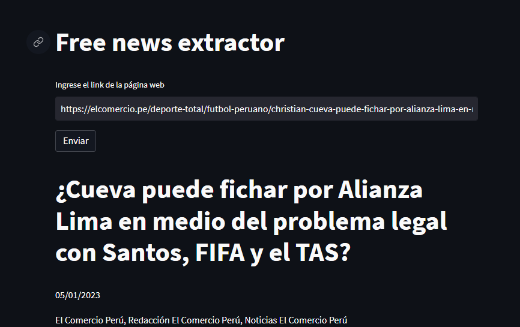
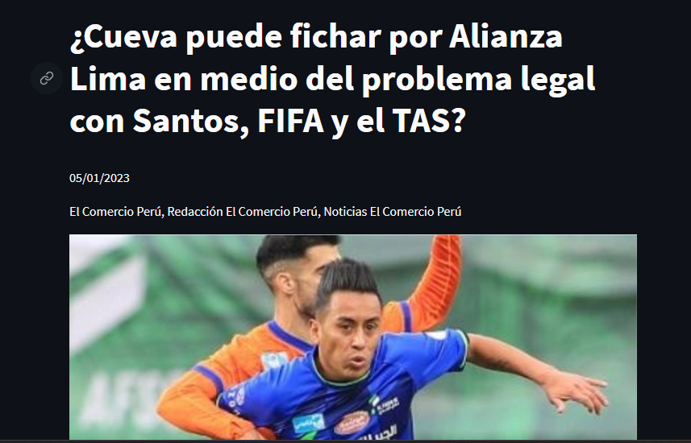
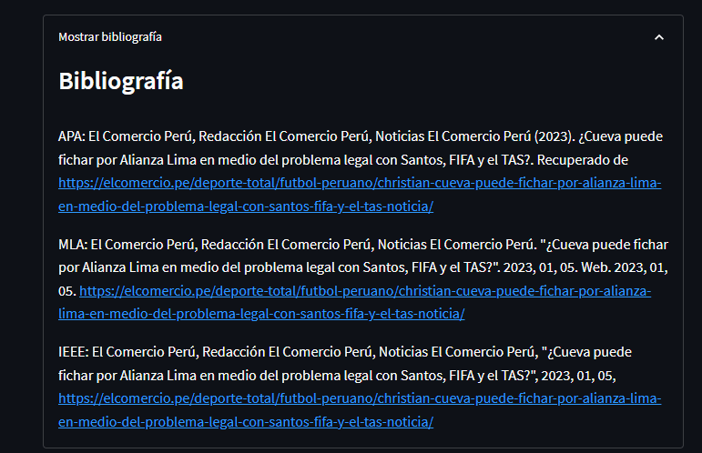

# news_free_for_all
Una pequeña web app realizada con python y streamlit que permite saltarse los muros de pago de los principales medios de comunicación escrita en Perú

#Link de la aplicación
https://kevinramosrivas-news-free-for-all-streamlit-app-b7vrd7.streamlit.app/

# Capturas de la webapp

  Link de la pagina a extraer la información
  

  Información extraida
  

  Citas automáticas generadas
  

